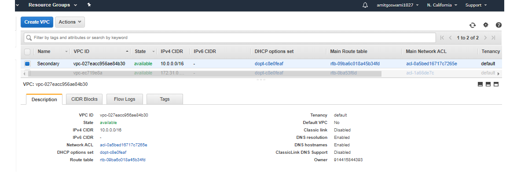
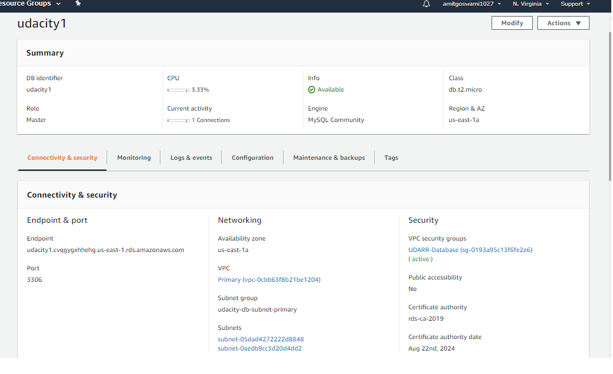
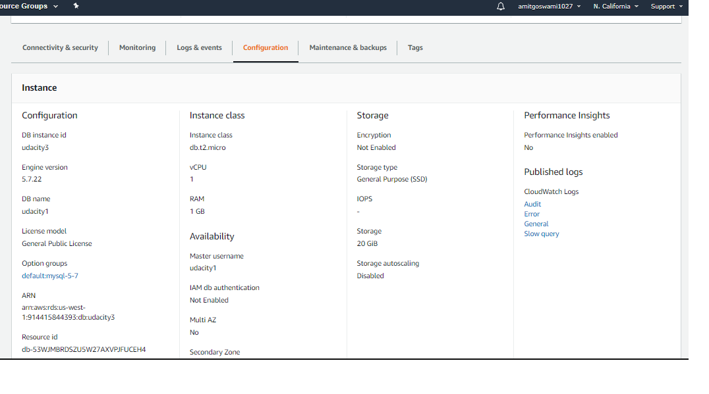
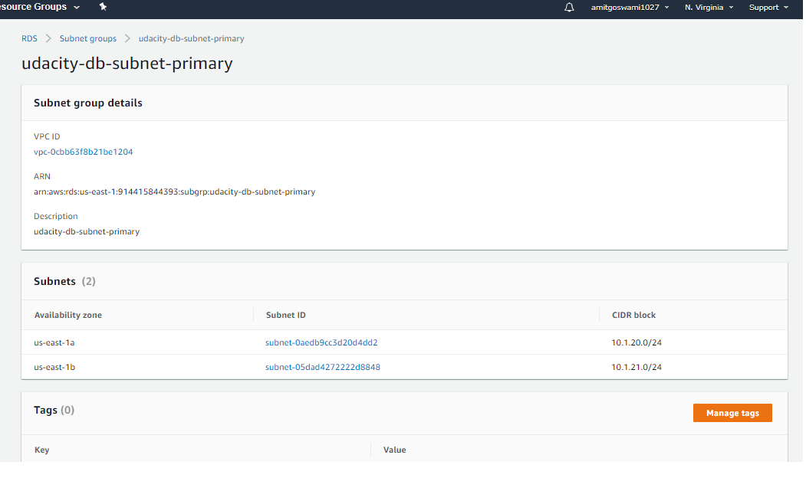
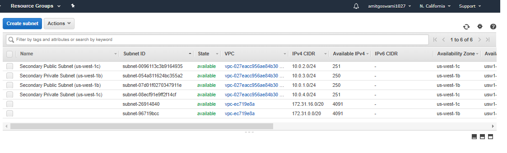
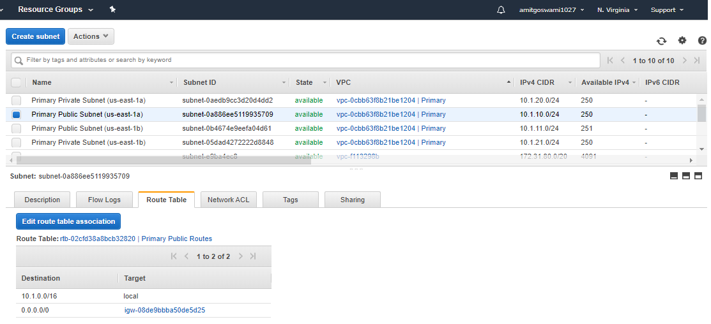
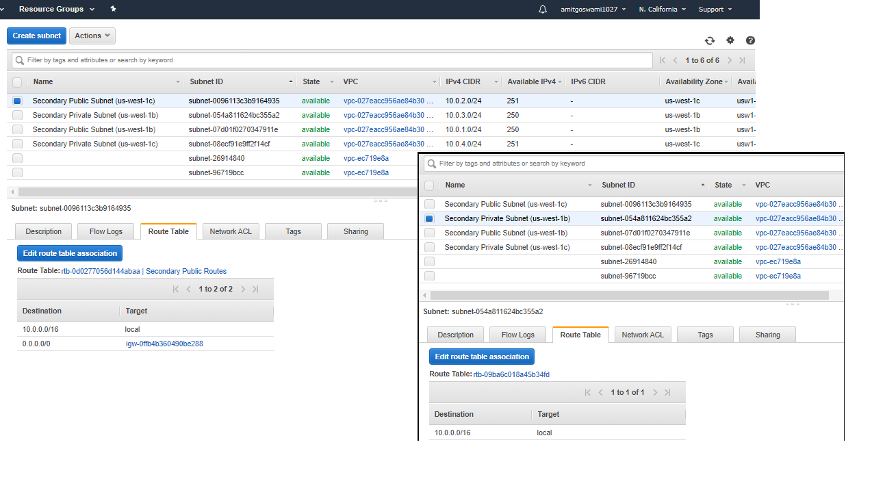
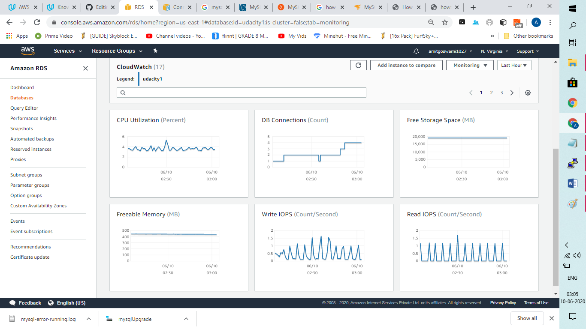
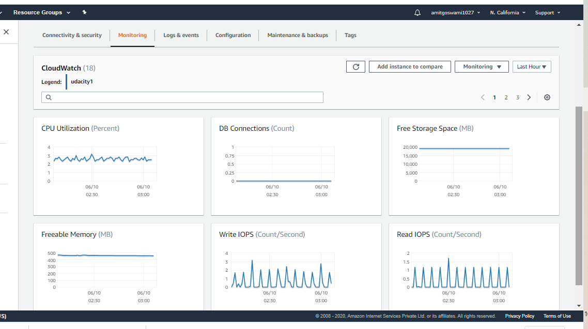
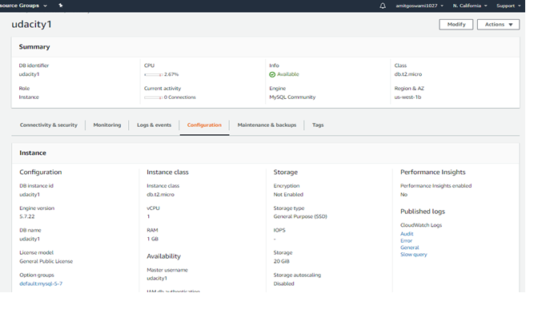

## AWS CLOUD ARCHITECT - NanoDegree 
## Project01
## Data durability and recovery
In this project you will create highly available solutions to common use cases.  You will build a Multi-AvailabilityZone, Multi-Region database and show how to use it in multiple geographically separate AWS regions.  You will also build a website hosting solution that is versioned so that any data destruction and accidents can be quickly and easily undone.

## Getting Started
To get started, clone this repo.  Aside from instructions, it contains a CloudFormation script to build an AWS VPC with public and private subnets.  It also contains an example website that you will host in an AWS S3 bucket in your account.

## Project Instructions
### Cloud formation
In this project, you will use the AWS CloudFormation to create Virtual Private Clouds. CloudFormation is an AWS service that allows you to create "infrastructure as code". This allows you to define the infrastructure you'd like to create in code, just like you do with software. This has the benefits of being able to share your infrastructure in a common language, use source code control systems to version your infrastructure and allows for documenting and reviewing of infrastructure and infrastructure proposed changes.

CloudFormation allows you to use a configuration file written in a YAML file to automate the creation of AWS resources such as VPCs. In this project, you will use a pre-made CloudFormation template to get you started. This will allow you to create some of the infrastructure that you'll need without spending a lot of time learning details that are beyond the scope of this course.

You can find the YAML file in the GitHub repo: https://github.com/udacity/nd063-c2-design-for-availability-resilience-reliability-replacement-project-starter-template/blob/master/cloudformation/vpc.yaml

## Part=01
Complete the following steps:
### Data durability and recovery
In order to achieve the highest levels of durability and availability in AWS you must take advantage of multiple AWS regions. 
1. Pick two AWS regions. An active region(us-east-1) and a standby region(us-west-1).
2. Use CloudFormation to create one VPC in each region. Name the VPC in the active region "Primary" and name the VPC in the standby region "Secondary". 
* Primary VPC (us-east-1) - 10.1.0.0/16 with Subnets : 10.1.10.0/24; 10.1.11.0/24;10.1.20.0/24;10.1.21.0/24
* Secondary VPC (us-west-1) - 10.0.0.0/16 with Subnets : 10.0.1.0/24;10.0.2.0/24;10.0.3.0/24;10.0.4.0/24;

**NOTE**: Be sure to use different CIDR address ranges for the VPCs.
**SAVE** screenshots of both VPCs after they are created. Name your screenshots: primary_Vpc.png, secondary_Vpc.png



### Highly durable RDS Database
1. Create a new RDS Subnet group in the active(us-east-1) and standby(us-west-1) region. -Done
   ### DB subnet group creation
   * [us-east-1] : RDS Screen, create the Primary DB subnet group. Choose the private subnets while creating the DB Subnet group.
   * [us-west-1] : RDS Screen, create the Secondary DB subnet group. Choose the private subnets while creating the DB Subnet group.
2. Create a new MySQL, multi-AZ database in the active(us-east-1) region. The database must:
     - Be a “burstable” instance class.
     - Have only the “UDARR-Database” security group.
     - Have an initial database called “udacity.”
3. Create a read replica database in the standby(us-west-1) region. This database has the same requirements as the database in the 
   active region. 

**SAVE** screenshots of the configuration of the databases in the active and secondary region after they are created. 


**SAVE** screenshots of the configuration of the database subnet groups as well as route tables associated with those subnets. Name the screenshots: primaryDB_config.png, secondaryDB_config.png, primaryDB_subnetgroup.png, secondaryDB_subnetgroup.png, primaryVPC_subnets.png, secondaryVPC_subnets.png, primary_subnet_routing.png, secondary_subnet_routing.png







### Estimate availability of this configuration
Write a paragraph or two describing the achievable Recovery Time Objective (RTO) and Recovery Point Objective (RPO) for this Multi-AZ, multi-region database in terms of:

1. Minimum RTO for a single AZ outage
2. Minimum RTO for a single region outage
3. Minimum RPO for a single AZ outage
4. Minimum RPO for a single region outage

Multi-Site
Multi-Site is an active-active configuration DR approach, where in an identical solution runs on AWS as your on-site infrastructure.
Traffic can be equally distributed to both the infrastructure as needed by using DNS service weighted routing approach.
In case of a disaster the DNS can be tuned to send all the traffic to the AWS environment and the AWS infrastructure scaled accordingly.
Preparation phase steps :
* Set up your AWS environment to duplicate the production environment.
* Set up DNS weighting, or similar traffic routing technology, to distribute incoming requests to both sites.
* Configure automated failover to re-route traffic away from the affected site. for e.g. application to check if primary DB is available 
  if not then redirect to the AWS DB
Somewhat this depends on your definition of RPO. Under most definitions of RPO it is the interval between backups and is measured in hours. It only applies to situations in which your live data is completely lost and you need to recover using a copy not maintained in real-time. Because the database also backs up the log file, RPO can be brought down to minutes (vs other kinds of data volumes). But the preferred mechanism is to use multiple synchronously maintained copies so that your RPO under all but the most extreme circumstances is 0.

If an RDS database instance's volumes were to be lost (logical or physical corruption), requiring recreating it from backup, then the RPO for Single-AZ, Multi-AZ, and even Aurora is typically around 5 minutes. That is the target interval for RDS to perform log backups to S3, so on a database volume loss you could have 5 minutes of log data that is also lost. There is no way to change the log backup interval, though that might be an interesting feature to add (hint: they would almost certainly have to charge for this as it would take a significant increase in resources behind the scenes to accomplish this at scale).

With Single-AZ the only live copy of your data is the EBS volume that holds the data for the instance. While EBS uses mirroring of data under the covers to provide durability and availability, there are several scenarios where you would have no choice other than to recover from backups. In this case you might want to apply the 5 minute log backup interval as your RPO.

With Multi-AZ the odds of data loss go way down because you have a separate synchronous copy of the volume being maintained in a separate data center (AZ). If your primary instance fails, you failover to the secondary instance with no data loss. There are far fewer scenarios where recreating the database from backup would be required, but there are still a few. Since volume-level replication is used, a corruption on the primary's volume may be replicated to the secondary's volume. And as rare as this scenario is, it would necessitate recovery from backups. I believe most customers think of Multi-AZ as having an RTO of 1-2 minutes and an RPO of 0, since they lose no data on any common failure. Again putting this into more traditional terms, even if a natural disaster were to destroy the data center housing the primary, the secondary would take over with no data loss. So assuming an RPO of 0 makes sense.

With Aurora the odds of data loss take another significant drop as it maintains 6 copies spread over 3 AZs, and it does that at a granularity of 10GB. So if something does become corrupt then it is a 10GB chunk of which there are 5 other copies plus backup information on S3, making it easy to transparently recover that one copy of the 10GB segment. There are almost no scenarios in which you would need to recreate the entire instance from backup. So truly an RPO of 0.

Bottom line is that I think for availability purposes RDS offers an RPO of 0 minutes. The next step would be to decide if you have a separate RPO for disaster recovery purposes, and what your disaster recovery plan looks like. Maybe it is just backups, or cross-region snapshot copies, or cross-region read replicas. None of these can achieve an RPO of 1 minute BTW, but DR strategies rarely require that.

https://blogs.cornell.edu/cloudification/category/devops/

**SAVE** your answers in a text file named "estimates.txt"

### Demonstrate normal usage
In the active region(us-east-1):
1. Create an EC2 keypair in the region
2. Launch an Amazon Linux EC2 instance in the active region. Configure the instance to use the VPC's public subnet and security group ("UDARR-Application"). 
3. SSH to the instance and connect to the "udacity" database in the RDS instance. 
   * Connect to the EC2 instance using putty.
   * aws configure, to configure the aws cli credentials.
   * sudo yum updates
   * Install mysql client / yum install mysql
   * mysql -u udacity1 -p -h udacity1.cvqgygxhhehg.us-east-1.rds.amazonaws.com
   * mysql -u udacity1 -p -h udacity1.cfcesfue6o5g.us-west-1.rds.amazonaws.com
   * Other Commands
     ```
     wget https://s3.amazonaws.com/rds-downloads/rds-combined-ca-bundle.pem
     RDSHOST="udacity1.cvqgygxhhehg.us-east-1.rds.amazonaws.com"
     TOKEN="$(aws rds generate-db-auth-token --hostname $RDSHOST --port 3306 --region us-east-1a --username amitgoswami1027)"
     mysql --host=$RDSHOST --port=3306 --ssl-ca=rds-combined-ca-bundle.pem --user=amitgoswami1027 --password=$TOKEN
     ```
4. Verify that you can create a table, insert data, and read data from the database. 
   * One MySQL Prompt, select the database by running the command: "USE udacity1"
   ```
   CREATE TABLE pet (name VARCHAR(20), owner VARCHAR(20), species VARCHAR(20), sex CHAR(1), birth DATE, death DATE);
   INSERT INTO pet VALUES ('Puffball','Diane','hamster','f','1999-03-30',NULL);
   INSERT INTO pet VALUES ('Puffball1','Amit','german','f','1999-03-30',NULL);
   INSERT INTO pet VALUES ('Puffball2','Sumit','germanshperd','f','1999-03-30',NULL);
   SELECT * from pet;
   ```
5. You have now demonstrated that you can read and write to the primary database
https://dev.mysql.com/doc/refman/5.7/en/getting-information.html

**SAVE** the log of connecting to the database, creating the table, writing to and reading from the table in a text file called "log_primary.txt"

### Monitor database
1. Observe the “DB Connections” to the database and how this metric changes as you connect to the database
2. Observe the “Replication” configuration with your multi-region read replica. 

**SAVE** screenshots of the DB Connections and the database replication configuration. Name your screenshots: monitoring_connections.png, monitoring_replication.png



## Part 2
### Failover And Recovery
In the standby region:
1. Create an EC2 keypair in the region
2. Launch an Amazon Linux EC2 instance in the standby region. Configure the instance to use the VPC's public subnet and security group ("UDARR-Application").
3. SSH to the instance and connect to the read replica database.
   * Connect to the EC2 instance using putty.
   * aws configure, to configure the aws cli credentials.
   * sudo yum updates
   * Install mysql client / yum install mysql
   * mysql -u udacity1 -p -h udacity1.cfcesfue6o5g.us-west-1.rds.amazonaws.com
4. Verify if you are not able to insert data into the database but are able to read from the database.
   * INSERT INTO pet VALUES ('Puffball5','Aryan','germanshperd','f','1999-03-30',NULL);
5. You have now demonstrated that you can only read from the read replica database.

**SAVE** log of connecting to the database, writing to and reading from the table in a text file called "log_rr_before_promotion.txt"


**SAVE** screenshot of the database configuration now, before promoting the read replica database in the next step. Name your screenshot: rr_before_promotion.png

6. Promote the read replica
7. Verify that if you are able to insert data into and read from the read replica database.
8. You have now demonstrated that you can read and write the promoted database in the standby region.

**SAVE** log of connecting to the database, writing to and reading from the database in a text file named "log_rr_after_promotion.txt"


**SAVE** screenshots of the database configuration after the database promotion. Name your screenshot: rr_after_promotion.png


### Part 3
### Website Resiliency

Build a resilient static web hosting solution in AWS. Create a versioned S3 bucket and configure it as a static website.

1. Enter “index.html” for both Index document and Error document
2. Upload the files from the GitHub repo (under `/project/s3/`)
3. Paste URL into a web browser to see your website. 

**Save** the screenshot of the webpage. Name your screenshot "s3_original.png"
You will now “accidentally” change the contents of the website such that it is no longer serving the correct content

You will now “accidentally” change the contents of the website such that it is no longer serving the correct content

1. Change `index.html` to refer to a different “season”
2. Re-upload `index.html`
3. Refresh web page

**SAVE** a screenshot of the modified webpage. Name your screenshot "s3_season.png"

You will now need to “recover” the website by rolling the content back to a previous version.

1. Recover the `index.html` object back to the original version
2. Refresh web page

**SAVE** a screenshot of the modified webpage. Name your screenshot "s3_season_revert.png"

You will now “accidentally” delete contents from the S3 bucket. Delete “winter.jpg”

**SAVE** screenshots of the modified webpage and of the existing versions of the file showing the "Deletion marker". Name your screenshots: s3_deletion.png, s3_delete_marker.png

You will now need to “recover” the object:

1. Recover the deleted object
2. Refresh web page

**SAVE** a screenshot of the modified webpage. Name your screenshot "s3_delete_revert.png"

## License


## AWS CLOUD ARCHITECT - NanoDegree

## Design For Availability,Reliability and Resiliency
* Availability: A measure of time that a system is operating as expected. Typically measured as a percentage.
* Reliability: A measure of how likely something is to be operating as expected at any given point in time. Said differently, 
  how often something fails.
* Resiliency: A measure of a system's recoverability. How quickly and easily a system can be brought back online.

### AZs AND REGIONS - HA Design
* AWS has around 20 Regions and 2-3 AZs in each Region.
* Highly available design is critical. Building for failover must be considered at every level of a system. Allowing for any 
individual component to fail and having a standby system able to take over is no small task, but HA design allows for platform 
systems to remain available regardless of any given server failing. 
* Most software platforms have Service Level Agreements (SLAs) that are critical to business stakeholders. All business functions tend to be concerned with a companies SLAs as they have wide-spread impact. The business both expects its vendors to meet their SLAs, and it is vital for a company to achieve its published SLAs in order to meet contractual obligations and support its customers.
* A Virtual Private Cloud (VPC) is a private network that you control within the larger AWS network. These private networks allow you to configure your network architecture the way you desire. A VPC is region specific. You decide if your VPCs connect to each other or if you keep them independent. If you connect your VPCs, it's up to you to configure them according to regular networking guidelines.
* IGW (Internet Gateway) is by default multi AZ, but NAT Gateway is AZ specific. DIFFERENCES: We can use advanced networking options in order to create a subnet so that resources in this subnet will be able to access the Internet, but will not be directly accessible from the Internet. This configuration allows you to put resources an additional layer deeper within your network. Security has a concept referred to as "defense in depth," which promotes multiple layers of defense such that a compromise of any one layer does not expose important assets. 

#### AWS networking does have some limitations that your own data center network would not.
* You cannot use multicast in a VPC
* You cannot put network cards into "promiscuous" mode to sniff ethernet packets.
* There are some restrictions on opening up ports for SMTP
* You cannot have network scans run against your account without discussing with AWS

#### You can connect VPCs together to enable:  
* Cross VPC connections
* Cross region connections
* Cross account connections

### BUILDING RESILENCY
* INTUTION : You can build a system that is singular with no failover options, and you can build systems that are Multi-AZ, 
Multi-Region with automated lightning fast failover. It is up to you to first determine what level of redundancy is 
appropriate and then figure out how to build that system.When approaching a new product or service, you should consider how 
important the system will be. Will the existence of the company depend on it staying up, or is it just helping a team vote on 
lunch choices? Will it bring in 10 million dollars a month, or is it providing a service for free? Ultimately, there are 
tradeoffs that need to be considered, and understanding them is key to understanding how resilient to make a system.
#### A. SERVER-BASED SERVICES (Services that are existing applications that AWS provides as "managed services" and run on individual server instances.): Server bases services are those that are "instance" based. Services like RDS and ElastiCache are 
instanced based in that you can run one instance, but you will not have any fault tolerance.  In order to gain high 
availability, you need to tell the service to provision a second instance for the primary instance to failover to, should 
there be an issue with it. This model is similar to traditional data center environments. A good way to tell if a service is a 
server/instance based service is if the service is a pre-existing product that AWS has create a service with (MongoDB, Redis, 
MySQL, Postgres). To get Multi-AZ availability, you need to configure a Subnet Group within the service. A subnet is attached 
to an AZ, and creating a grouping of subnets within the service tells the service where it can place the primary and standby 
instances of a service.
* AZ REDUNDANCY: Subnet Groups are key to creating Multi-AZ redundancy in server-based services. Subnet Groups define the 
different availability zones that your service will run in, and having multiple instances allow for fast failover if a single 
AZ were to go down. Multi-Region redundancy is more tricky. Depending on the service, it is harder, or not possible to run a service with failover between regions.
* Most of the server based services have similar concepts for handling a hardware failover automatically. This functionality 
is the same that handles a single availability zone failure. By creating active/standby pairs of servers that replicate and by 
having each member of the pair in a different availability zone, you create the infrastructure that handles both of these 
failure mode.
* ElastiCache: ElastiCache is one of these services. You will create an ElastiCache cluster that does not have a single point 
of failure, and that can handle an AZ outage. First, create an ElastiCache subnet group in the default VPC using each available subnet and then create a multi-AZ redis cluster.
#### B. DynamoDB is a native AWS service for non-relational databases. It is Multi-AZ by default and can be made Multi-Region 
with DynamoDB Streams and by creating a Global DynamoDB table. DynamoDB scales to extremely high loads with very fast response 
times. It also supports configuring a caching layer in front of the database.DynamoDB Streams allow every change made to a 
DynamoDB table to be "streamed" into other services. These other services can then choose what actions to take on the 
different items or operations within the stream.
* DynamoDB Streams And Global Tables : DynamoDB Streams capture all changes made to a DynamoDB Table. This includes only 
actions that modify the table, not actions that only read from the table.
* DynamoDB Global Tables take advantage of DynamoDB Streams the create Multi-Region active/active DynamoDB Tables. This allows 
you to modify a table in multiple regions and have those changes reflected in all regions. 
* Multi-Region, active/active data stores are a big deal and extremely useful for use cases that require it.
#### C. S3 is one of the very first AWS services and is an object store. You create buckets and you can store an unlimited number of objects in a bucket.
* With S3 Events allow you to execute Lambda functions on the creation, updating or deleting of objects.
S3 Versioned Buckets keep all versions of an S3 object as you make changes to the object. You can even use this functionality 
to recover deleted objects.

### BUSINESS OBJECTIVES: Business objectives are where the other business functions of your company meet with the Engineering 
function. These other areas of the company focus on signing customers, managing finances, supporting customers, advertising 
your products, etc. Where all of these teams meet is in the realm of contracts, commitments and uptime. This is where other 
parts of a business have to collaborate with Engineering in order to come up with common goals and common language.
#### A. UPTIME: Percentage of time system is up and running normally.
* Allowed downtime = (30 days 24 hours 60 minutes) - (30 days 24 hours 60 minutes * SLA percentage)
* 99% = 7.3 hours of allowed downtime per month
* 99.9% = 43.8 minutes of allowed downtime per month
* 99.99% = 4.38 Minutes of allowed downtime per month
* 99.999% = 26.3 sec of allowed downtime per month
#### B. DOWNTIME: Total time - UPTIME = DOWNTIME
#### C. Calculating Service Level Agreements -Calculating Availability
When drafting a Service Level Agreement (SLA) for your platform, there are many things to consider. You will need to ponder 
what you will need to implement in order to meet the SLA, and also understand what types of guarantees that you are providing 
to your customers that you will meet the SLA. Monetary compensation is common for SLA violations either in the form of service 
credits or outright refunds.
Often when considering what type of SLA a platform can provide, there is a tendency to forget to consider some of the components of the system. If the SLA isn't carefully considered, it can quickly become very difficult and expensive to meet.
Your company would like to offer a 99.9% SLA on your entire platform. Consider the following services that are required for your service to operate normally:
```
    Email service provider: 99.9%
    DNS provider: 99.99%
    Authentication service provider: 99.9%
    AWS services: 99.9%
    Twitter feed: 99%
```
Write an SLA for your platform that breaks down acceptable amounts of downtime for your application and for third-party services separately. Also, define periods of excused downtime and caveats for reduced functionality of non-critical components.
* ABC Company Hosted Applications
ABC Company shall provide general platform uptime of 99.9%. This shall exclude a regular maintenance window from 1am - 5am CST every Sunday, as well as windows from 1am - 5am on other days provided that ABC provides 24 hours of notice.
* ABC Company Critical Third-Party Components
Some components of our system are beyond our control, and thus, we can only pass through the provided SLA of these vendors. We only work with vendors who provide an SLA of 99.9% or better for all critical services.
* ABC Company Non-Critical Components
Those components deemed non-critical (listed below) are subject to a 95% uptime SLA. These components are not core to our offering, but provide certain "nice to have" functionality. In cases where these services are not available, our platform shall continue to operate and provide core functionality as normal.
#### RTO (Recovery Time Objective):Recover Time Objective (RTO) is the maximum time your platform or service can be 
unavailable. If your platform is offline from noon until 5:00pm and you have a 4 hour RTO, then you have failed to maintain 
your RTO.
When setting an RTO, be sure to consider the many items that go into meeting an RTO. What are the things that you will need to have in place to achieve your RTO? If your RTO is less than 72 hours, you will need to have folks available on the weekend to fix your system. If it is less than 8 hours, you will need people available in the middle of the night. Not only will you need people available at these off-hour times, but they will need to have a wide range of knowledge on your systems, access to the systems, and the trust of the company to make critical changes on their own.
* How to actually calculate the RTO
```
Recovery Time Objective (RTO)
    00:00 - Problem happens (0 minutes)
    00:05 - An amount of time passes before an alert triggers (5 minutes)
    00:06 - Alert triggers on-all staff (1 minute)
    00:16 - On-call staff may need to get out of bed, get to computer, log in, log onto VPN (10 minutes)
    00:26 - On-call staff starts diagnosing issue (10 minutes)
    00:41 - Root cause is discovered (15 minutes)
    00:46 - Remediation started (5 minutes)
    00:56 - Remediation completed (10 minutes)

Total time: 56 minutes
An RTO of one hour for this incident would be reasonable.
```
#### RPO (Recovery Point Objective): Recovery Point Objective (RPO) is the maximum amount of time that your system can lose 
data for. RPO is not tied to whether your system is available, it is a measure of the window of time that you may lose data 
in. If you take a database snapshot at midnight every day and you have a data corruption issue at 7:00am requiring you to 
restore from backup, you have a 7 hour RPO. It may take you until 8:00am to restore service, but as long as your data loss 
stops at 7:00am, that is when your RPO window closes.
* If your database goes down at 7:00pm and your application continues to run until 7:20pm but is failing to store the data it receives, and then the database is brought back online at 8:00pm, what was the RPO of the outage? Ans : 20 Minutes ???
* If your database goes down at 7:00pm and your application continues to run until 7:20pm but is failing to store the data it receives, and then the database is brought back online at 8:00pm, what was the RTO of the outage?Ans : 1hour ??

#### DISASTER RECOVERY : RTO and RPO numbers apply to localized outages, but when setting your RTO and RPO, you must take into 
account worst case scenarios. The term Disaster Recover is used to describe a more widespread failure. In AWS, if you normally 
run your services in one region, a large enough failure to make you move your system to another region would be a Disaster 
Recovery (DR) event.
Disaster Recovery usually involves the wholesale moving of your platform from one place to another. Outside of AWS, you might 
have to move to a backup data center. Inside AWS, you can move to a different region. Disaster recovery is not something you 
can do after an incident occurs to take down your primary region. If you have not prepared in advance, you will have no choice 
but to wait for that region to recover. To be prepared ahead of time, consider all of the things you will need to restart your 
platform in a new home. What saved state do you need, what application software, what configuration information. Even your 
documentation cannot live solely in your primary region. All of these things must be considered ahead of time and replicated 
to your DR region.
* AWS CloudFront is a content distribution network. It allows for edge location spread around the world to cache content so 
that the original source only needs to be consulted after a certain amount of time has expired. CloudFront is a global AWS 
service and has the ability to serve files from an S3 bucket. It also can be configured to have a primary bucket and a backup 
bucket in case the primary is not available.
* Create two S3 buckets in two different regions and then create a CloudFront distribution and create an Origin Group with both buckets and use that as the origin for the CloudFront distribution.

#### MONITORING 
* AWS Services That Publish CloudWatch Metrics : https://docs.aws.amazon.com/AmazonCloudWatch/latest/monitoring/aws-services-
cloudwatch-metrics.html

### IMPORTANT LINKS FOR READING
* Global Infrastructure : https://aws.amazon.com/about-aws/global-infrastructure/
* Case Studies: https://aws.amazon.com/solutions/case-studies/?customer-references-cards.sort-by=item.additionalFields.publishedDate&customer-references-cards.sort-order=desc
* AWS Realiability Pillar : https://d1.awsstatic.com/whitepapers/architecture/AWS-Reliability-Pillar.pdf
* CIDR : https://en.wikipedia.org/wiki/Classless_Inter-Domain_Routing
* NAT: https://en.wikipedia.org/wiki/Network_address_translation
* WannaCry ransomware attack: https://en.wikipedia.org/wiki/WannaCry_ransomware_attack
* S3 Pricing: https://aws.amazon.com/s3/pricing/
* HIGH AVAILABILITY - NO OF NINES : https://en.wikipedia.org/wiki/High_availability
* Atlassian Incident Handbook : https://www.atlassian.com/incident-management/handbook/postmortems#postmortem-issue-fields
* GitHub Post-incident analysis: https://github.blog/2018-10-30-oct21-post-incident-analysis/
* AWS Services That Publish CloudWatch Metrics : https://docs.aws.amazon.com/AmazonCloudWatch/latest/monitoring/aws-services-cloudwatch-metrics.html


